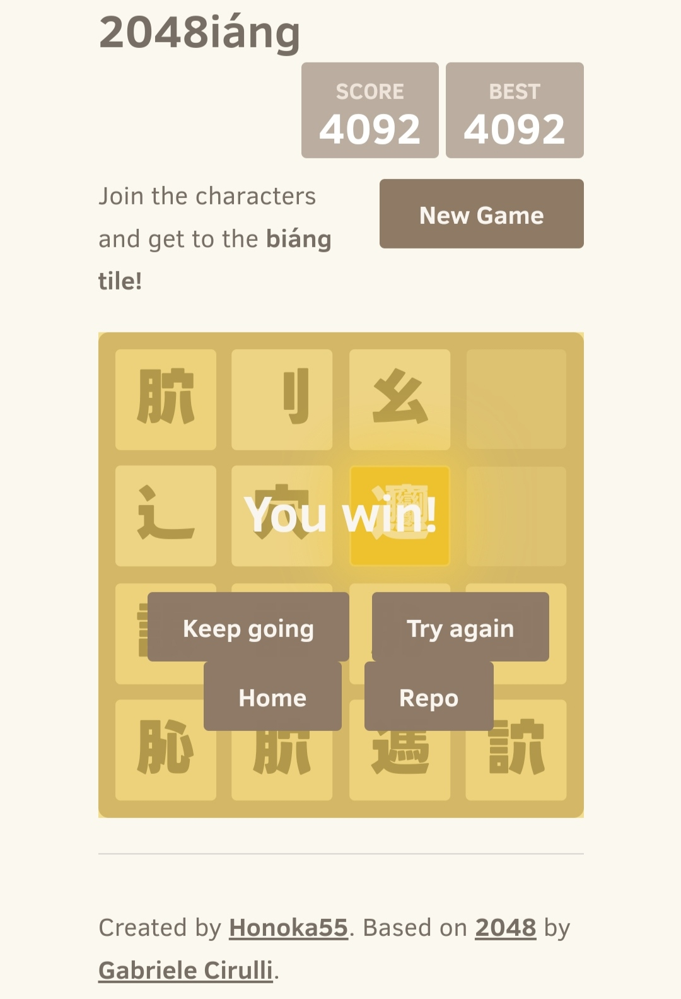

# 2048iáng
A 2048 game but the goal is to merge into the 57-stroke Chinese character “𰻞” (*biáng*).

[Play it here!](http://honoka55.github.io/2048iang)

## Screenshot

## License

2048iáng is licensed under the [MIT license](LICENSE.txt).
